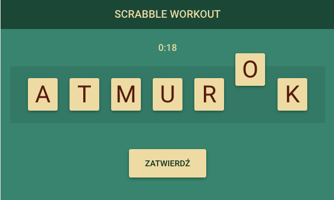
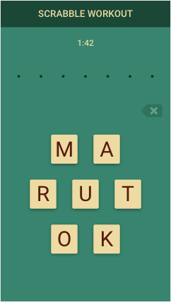
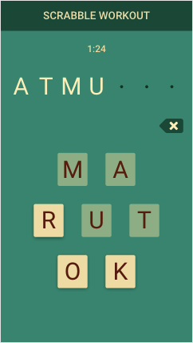

Hi, welcome to

# Scrabble Workout!

Scrabble Workout is an app aiming to make you a Scrabble Master. Once you start a game you get a set of 7 tiles with letters. Your task is to form them into a 7-letter word within a given time. Some words have anagrams so more than one solution is possible.

### Technologies & Tools

- React
- Redux
- React Router
- Sass
- CSS Modules
- react-beautiful-dnd
- axios
- Jest
- Webpack
- circleCI

### Contributors

[tomecko](https://github.com/tomecko)

### Demo

**[Scrabble Workout](https://scrabble-workout.github.io/scrabble-workout/)**

### Previews

 

 

